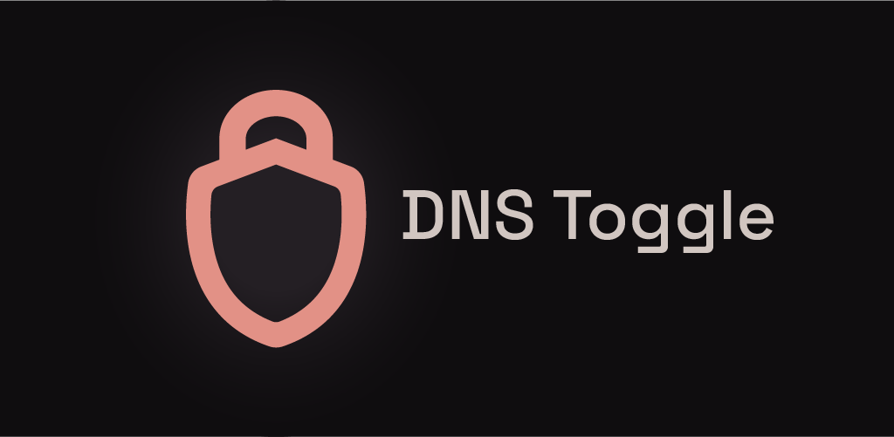
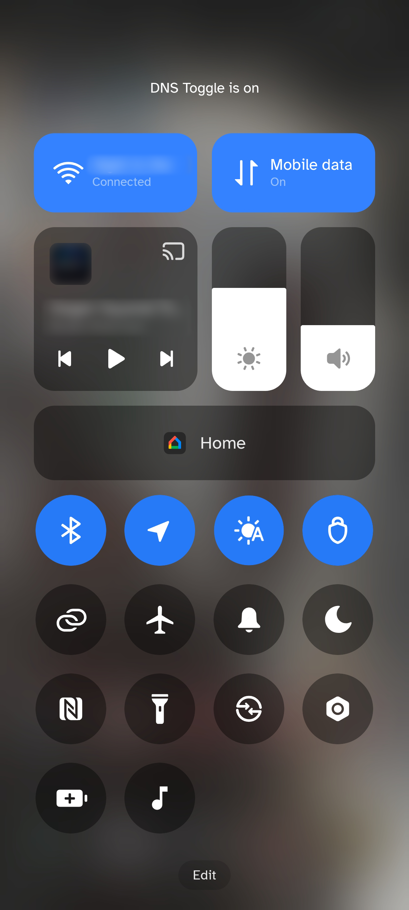
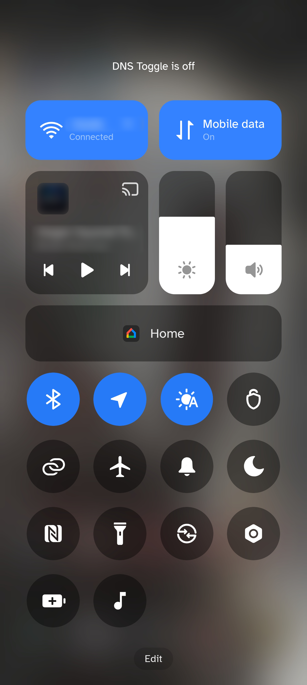
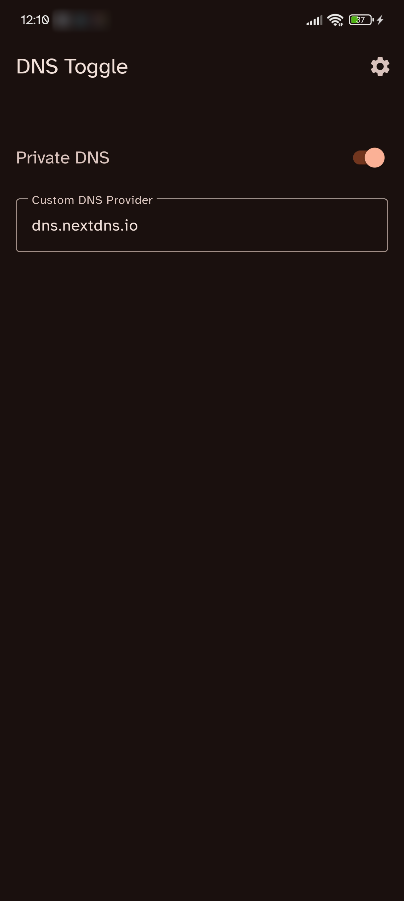
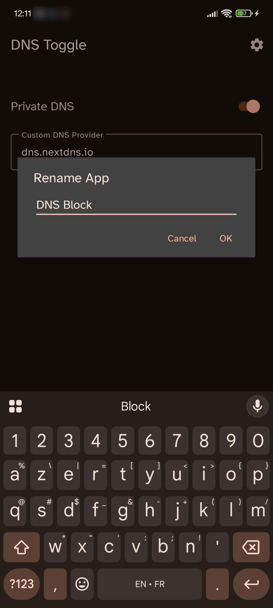

[](LICENSE)

# [](#)

A tiny Android app that allows you to easily toggle your phone's Private DNS through the Quick Settings panel.

<p align="center">
  
  
  
  
</p>

> [!WARNING]
>
> To modify the Private DNS system settings, this app requires the `WRITE_SECURE_SETTINGS` permission. Since this is a protected system permission, you must either have a rooted device or manually grant the permission using ADB.
>
> If your device is not rooted, you can grant the required permission by connecting your phone to a computer with USB debugging enabled and running the following ADB command:
>
> ```bash
> adb shell pm grant com.ericlowry.dnstoggle android.permission.WRITE_SECURE_SETTINGS
> ```

## Features

### Quick Settings Tile

Adds a Quick Settings tile to toggle your Private DNS on and off with a single tap from your notification shade.

> [!NOTE]
>
> The app does not create an app drawer icon, as it is meant for use through the Quick Settings panel.

#### Additional Options

By long-pressing the Quick Settings tile, you can:

- **Custom DNS Provider**: Define a custom DNS provider hostname (e.g., `dns.adguard.com`) to use when Private DNS is active. When turned off, the system defaults back to automatic/opportunistic mode.
- **Dynamic Tile Labeling**: Tap the settings gear icon in the top-right corner to rename the quick-settings label.

## Usage

1. Install the app on your Android device.
2. Grant the `WRITE_SECURE_SETTINGS` permission using root or the ADB command provided above.
3. Edit your Quick Settings panel and drag the **DNS Toggle** tile into your active tiles.
4. Long-press the tile to open the configuration UI to set your custom DNS hostname.
5. Tap the tile to toggle the Private DNS on or off!

## Troubleshooting

- **ADB Command Fails**: Ensure USB Debugging is enabled in Developer Options, and that your device is recognized by running the `adb devices` command.
- **Tile is Grayed Out**: This usually means the permission was not granted correctly. See the warning above.

## Privacy

This app is just a shortcut for existing settings; it doesn't store or send any information from your device.

## Building from Source

You can build the app yourself by opening this project in Android Studio or by running `./gradlew assembleDebug` using your prefered command line tool.
