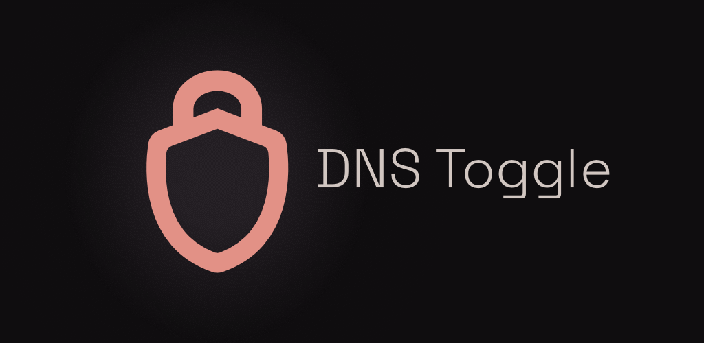
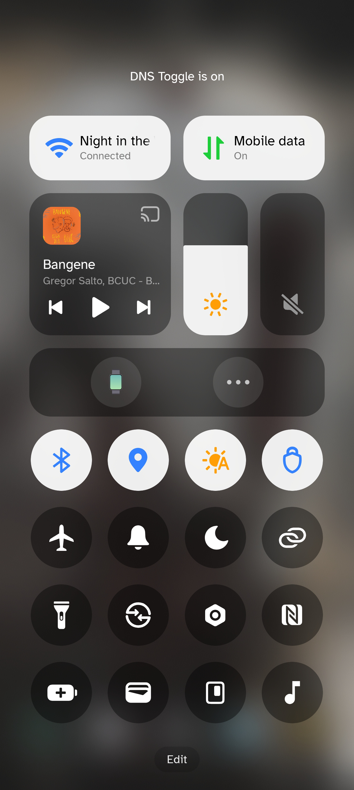
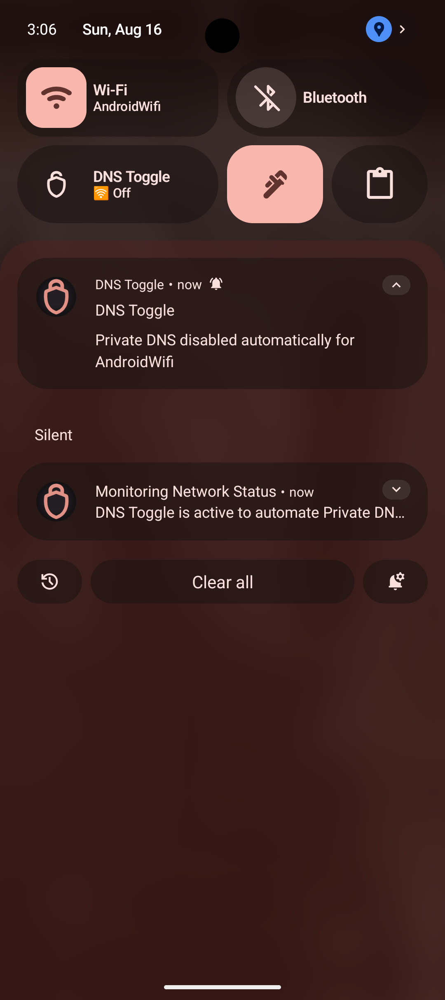
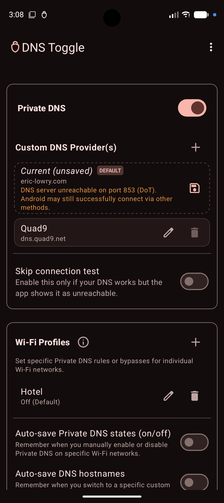
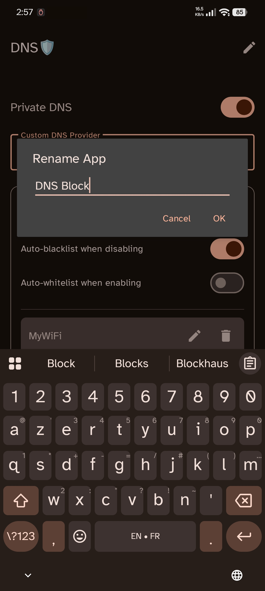

[](LICENSE) [](https://github.com/ELowry/DNSToggle/releases/latest) [](https://apt.izzysoft.de/fdroid/index/apk/com.ericlowry.dnstoggle) <!--[](https://f-droid.org/packages/com.ericlowry.dnstoggle/) -->

# [](#)

A tiny Android app that allows you to easily toggle your phone's Private DNS through the Quick Settings panel.

<p align="center">
  
  
  
  
</p>

> [!WARNING]
>
> To modify the Private DNS system settings, this app requires the `WRITE_SECURE_SETTINGS` permission. Since this is a protected system permission, you must either have a rooted device, use [Shizuku](https://shizuku.rikka.app/) (no PC or root required after a one-time setup), or manually grant the permission using [ADB](https://developer.android.com/tools/adb).
>
> If your device is not rooted, you can grant the required permission by connecting your phone to a computer with USB debugging enabled and running the following ADB command:
>
> ```bash
> adb shell pm grant com.ericlowry.dnstoggle android.permission.WRITE_SECURE_SETTINGS
> ```

## Features

### Quick Settings Tile

Adds a Quick Settings tile to toggle your Private DNS on and off with a single tap from your notification shade.

#### Additional Options

By long-pressing the Quick Settings tile, you can access the configuration menu to:

- **Custom DNS Provider**:  
  Set and label one or more custom Private DNS hostnames you can easily toggle between (e.g., `dns.adguard.com`).
    - Optional automatic DNS hostname reachability check.
    - Automatically detects your active system DNS so you can easily save it to your list.
- **Wi-Fi Blacklist**:  
  Automatically disable Private DNS when connected to specific Wi-Fi networks.
    - Optional automated addition/removal of the current Wi-Fi SSID from the blacklist when manually toggling the Quick Settings tile.
    - Optional connectivity watchdog that automatically blacklists the current Wi-Fi SSID when Private DNS causes connectivity issues.
- **VPN toggling**:  
  Automatically set a DNS hostname or toggle Private DNS when a VPN is in use on the device.
- **Backup & Restore**:  
  Export and import your configuration via password-encrypted `.dnstoggle` files.
    > _Note: For security, your encrypted hostnames and blacklists are excluded from cloud backups and must be transferred manually._
- **Dynamic Tile Labeling**:  
  Rename the Quick Settings tile.
- **Hide App Icon**:  
  Optionally hide the app from your launcher drawer to keep your home screen clean.
- **USB Debugging Tile**:  
  (_Requires Developer Mode_) Tap the app version number at the bottom of the settings menu 5 times in quick succession to add a USB Debugging Quick Settings tile.

## Usage

1. Install the app on your Android device.
2. Grant the `WRITE_SECURE_SETTINGS` permission using root or Shizuku (you will be prompted when using the app), or the ADB command provided above.
3. Edit your Quick Settings panel and drag the **DNS Toggle** tile into your active tiles.
4. Long-press the tile to open the configuration UI to set your custom DNS hostname.
5. Tap the tile to toggle the Private DNS on or off!

> [!NOTE]
>
> **Saved data may disappear**
>
> Android's secure Keystore protects your saved Wi-Fi networks and hostnames. If you change your device's lock screen PIN, pattern, or biometric settings, Android may delete the stored data.
>
> This encrypted data cannot be transferred to another device via the default Android cloud backup. Please use the app's built-in Export feature before migrating devices.

## Troubleshooting

If you encounter issues not covered here, please [open a support ticket](https://github.com/ELowry/DNSToggle/issues/new/choose).

- **ADB Command Fails**:  
  Ensure USB Debugging is enabled in Developer Options, and that your device is recognized by running the `adb devices` command.
- **Tile is Grayed Out**:  
  This usually means the permission was not granted correctly. See the warning above.
- **Custom DNS is marked as "Unreachable"**:  
  Some strict DNS providers block automatic connection tests. If you are certain the address is correct, you can toggle on the `Disable DNS Test` just option below.
- **Automation stops working**:  
  Some Android devices aggressively kill background apps to save battery. If the Wi-Fi Blocklist or VPN Override features stop working while the app is closed, you may need to manually disable `Battery Optimizations` or enable `Autostart` for DNS Toggle in your device's settings.

## Permissions

- **WRITE_SECURE_SETTINGS**:  
  Required to modify system Private DNS settings. Must be granted via root, Shizuku, or using ADB.
- **INTERNET** _(optional)_:  
  Used to verify that your Custom DNS Provider is online and reachable before applying it.
- **Location & Nearby Devices** _(optional)_:  
  Required only for **Wi-Fi Blocklist** automation. Used to identify the Wi-Fi network name (SSID) locally.
- **Notifications** _(optional)_:  
  Used for status alerts when Private DNS is automatically adjusted.

## Privacy

This app is a shortcut for existing system settings. It does not store, collect, or share any personal data. All permission-related activities (such as reading the Wi-Fi SSID) occur strictly on-device for automation purposes.

## Contributing & Translations

Contributions are always welcome! Whether you want to add a new feature, fix a bug, or help translate the app into your native language, please check out our [Contributing Guidelines](CONTRIBUTING.md) to get started.

### Translation Status

[](https://hosted.weblate.org/engage/dns-toggle/)

## License

This project is licensed under the [MIT License](LICENSE).
